# Crypto Blog

The project is a full stack developed website with 2 main features. The first feature is a blog where the Site User can read, comment and like the different articles which are divided in 4 categories: Crypto News, Bitcoin, Exchange and Decentralize. In this feature, only the admin can post article and use the Django admin panel to do so. The admin can also use the Django admin panel to update and delete articles. The second feature allow registered user to report a scam which can be view on the scam page once it is approved by the admin. Once approved, the registered user can edit or delete his post. None registered user can only view the scams. The website aim to educate the users about Crytocurrencies and help them avoid existing scams.

The live link can be found here: https://chess-game-vincent.herokuapp.com/

## Features

There are 2 main features on the websites: The blog and the scam librairy.

### Blog

This feature is for registered and unregistered user.

__Categories__

- The blog is divided in 4 categories:
    - Crypto News: General news in the crypto worls
    - Bitcoin: Article specific to Bitcoin
    - Exchange: Article specific to exchanges
    - Decentralize: Article specific to decentralize apps

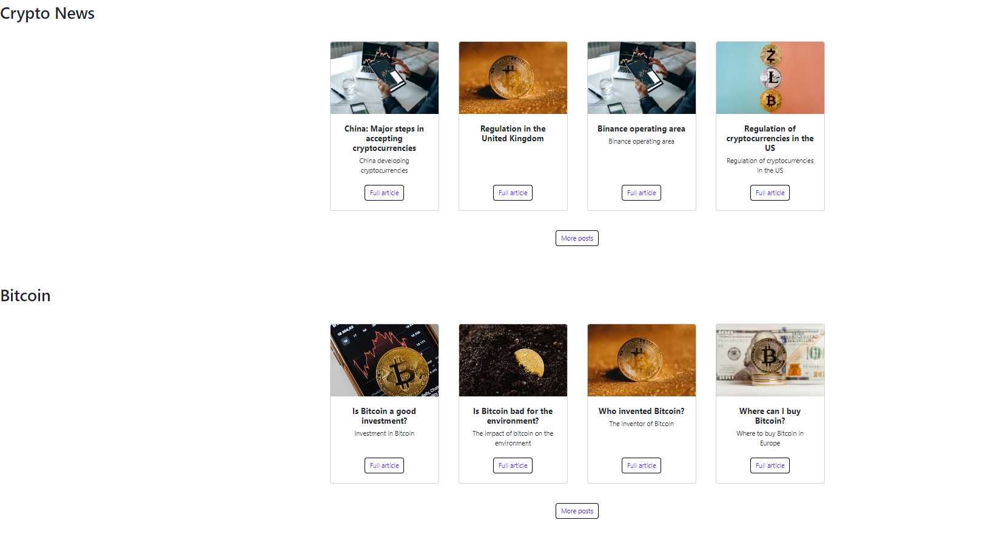

- The main page is limited to a maximum of 4 article per category. When the user click on "More posts", the user is redirected to a page specific to that category with all available articles regarding that category.

__Full article__

- Each article is presented with a picture, title, and an excerpt. When the user click on "Full article", the user is redirected to a page with the full detail of the article.

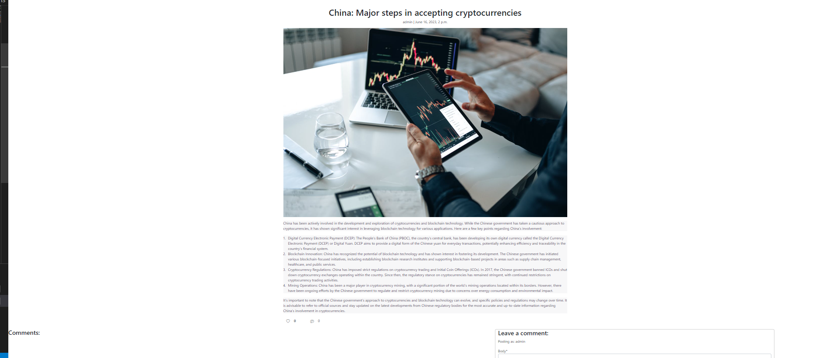
 
__Comment & likes__

- On this full article page, the user can see the comments and likes regarding that article. If the user is registered, the user can add a comment or like the article. Comments required to be approved by the admin before being showed on the page.

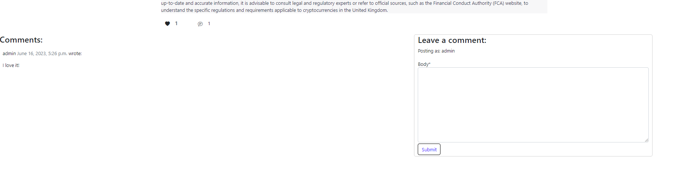

### Scam librairy

User can view existing scams and registered user can report scams.

__View report scams__

- All site users can view the reported scams on the scam page. Each scam is shown with a title, a brief description, the date it has been reported and a link to the full details of the scam. When the user click on "Full details" link, the user is redirected to a page with the full details of the scam.

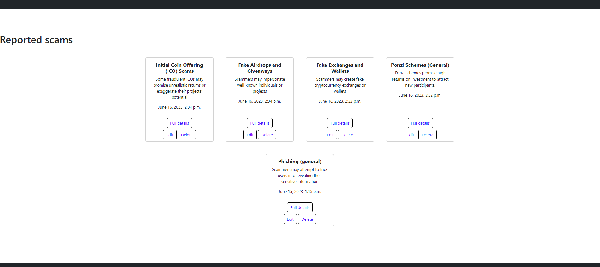

__Report/edit/delete a scam__

- A registered user can report a scam through the Report a scam link on the top left of the page. Once clicked, the registered user has to fill a form which all fields are required. Once completed and posted, the scam is waiting approval from the admin of the site before being viewed on the scam page.

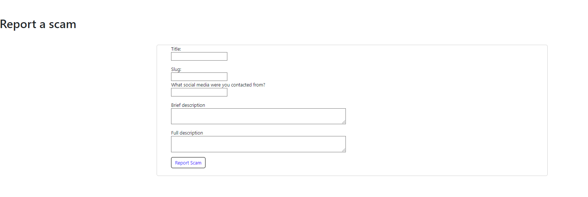

- Once a scam is approved by the admin, it is shown on the scam page. The original author of the reported scam has the possibility to edit or delete his scam. When the original author click on the edit button, he/she redirected to a page where the form field are already filled with original values of the scam. After changing the desirable values from the form, the original author can click on update scam and the scam will be automatically updated.

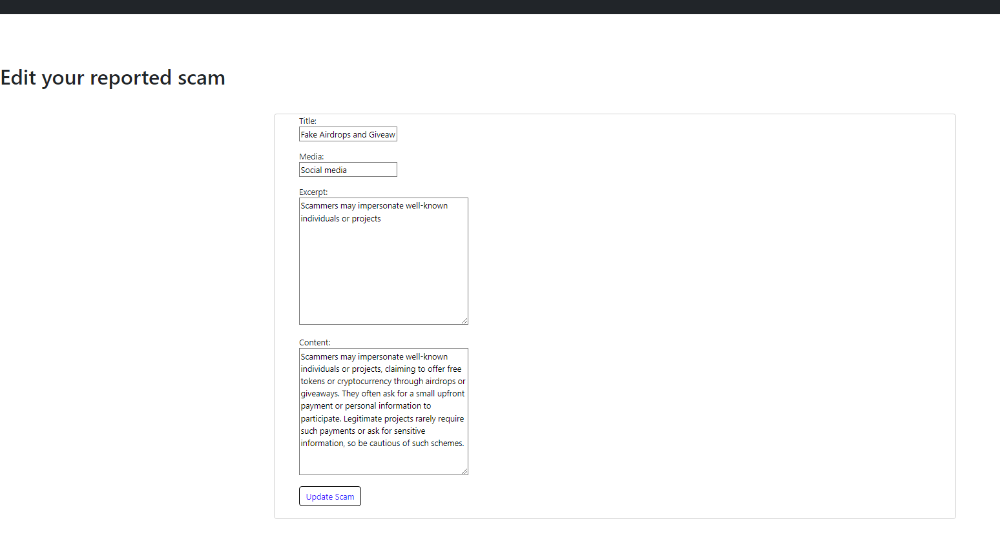

- The original author can also delete his scam once it is shown on the page by clicking the button delete. When the delete button is clicked, it will redirect the  author to a confirmation page. "Yes" will delete the scam, "No" will keep the scam. In both situation, the author will be redirected to the scam page after the click.

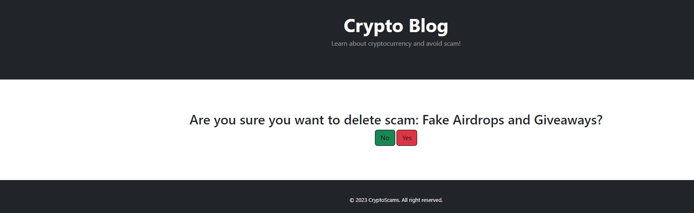

## Admin features

__Issue posts__

- The admin can issue post through the django admin panel. The admin can also keep draft post and only published once the post is ready. If no image are uploaded when creating a post, a default picture will be shown on the website. Summernote API is set up for styling of the content created through the django admin panel. In the django admin panel, the most relevant data from the model are shown, a filter option is available and a action to delete any of the selected post.

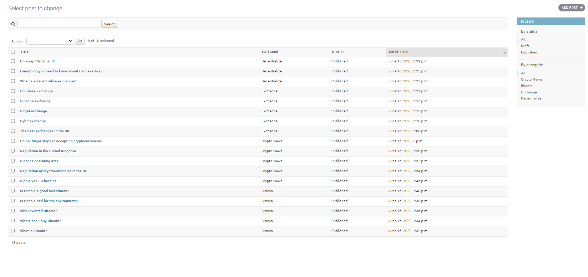
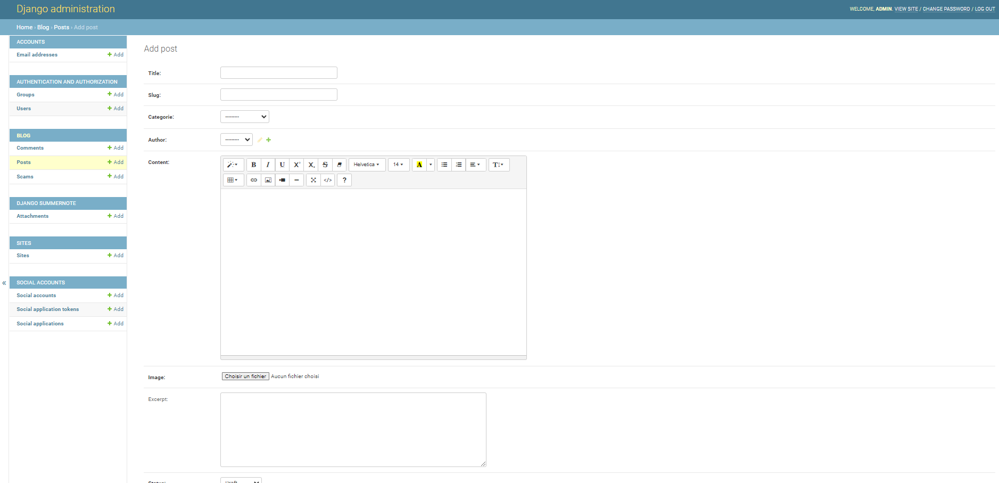

__Approve comments & scams__

- The admin can see all comments or scams that is not approved in the django admin panel. The admin can simply approved the comments or scams by using the action approve comments/scams after selectioning the relevant comments/scams. Different data are shown in the table to make it more relevant to comments and scams like the email and name of the issuer. Filters are also available for the comments and scams section.

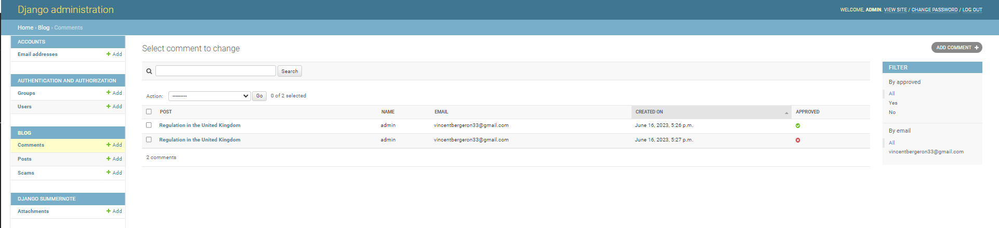
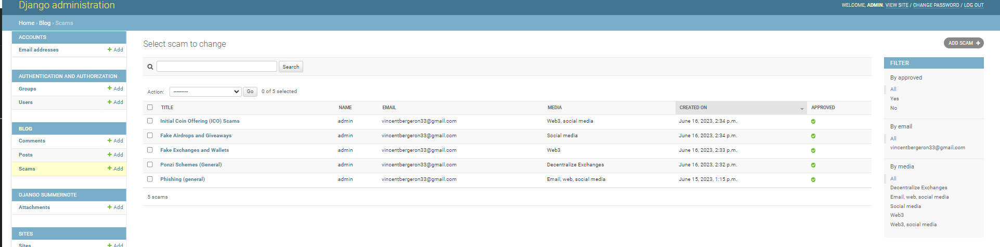

### Features left to implement

- A search option could be implemented in the scam page to search through the tittles.

## Testing

### Validator Testing

## HTML W3 validator

- All html pages have been run through the validator. Only one error have been detected regarding the {{ post.content|safe }} command. After research and test, it looks like the validator struggle to load the css and show parse error.

## CSS validator

- No error have been found except error linked to using Bootstrap and startbootstrap.

## PEP8 Python Validator

- Finaly the code has been validated through the PEP8 Python Validator. The only result is ""Line too long" in the setting.py which is acceptable.

### Unfixed Bugs

 - All bugs have been fixed.

## Deployment

- The project was deployed using the app Heroku. The steps explained in the Code Institue course have been followed:
    - Complete the project and push it to Git Hub
    - Create a Heroku account
    - Create a app on Heroku account
    - Link Git Hub to Heroku
    - Search for the repository and add link it to Heroku
    - Add the buildbacks Python and Node.JS
    - Deploy the project

The live link can be found here: https://chess-game-vincent.herokuapp.com/

- Note that no creds are required for this project. Name of the python file has been changed from game to run to accomodate the Heroku requirement and all python files move to the main folder.

## Credits

- The coding itself was developed using the tool of the course. For details how to run specific functions, the website Stack Overflow was a great help. Please note that no code has been copy/paste from any website. The website was only a tool to understand the mechanic of the code. My tutor really helped me in developping new unlearn functions.

### Content

- Non-applicable

### Media

- Non-applicable.

